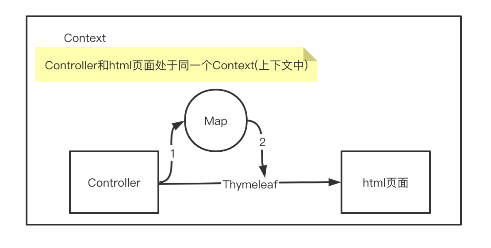

# 《SpringBoot 2.x》入门：框架介绍与HelloWorld

- MVC架构思想
- 使用STS构建SpringBoot项目
- 使用SpringBoot构建Mvc web项目
- MVCWeb项目中的注入
- 热部署

## 1.介绍

SpringBoot主要解决的是在微服务的架构下简化配置（有快速配置）、前后端分离、快速开发

> yuk: 比如tomcat的配置就不需要配置, 有默认配置, 只暴露出来application.properties这一个配置文件;

优点：

- 提供了快速启动入门

- 开箱即用、提供默认配置

- 内嵌容器化web项目

- 没有冗余代码生成和xml配置要求

## 2.运行Demo

### 创建项目

创建SpringBoot项目的几种方式：

- 官网的Initializr(http://start.spring.io/)

- 使用Eclipse、STS、Idea等IDE创建Maven项目并引入依赖

- 使用STS插件的Spring Initializr创建项目


​                                                  

生成下载demo.zip

### 导入项目

#### 1.Import一个Maven项目

   

#### 2.选择要导入的文件

   

#### 3.项目骨架

   

### 启动项目

- 直接run启动程序里的Main（）方法
- 安装过STS插件或使用STS可以在项目上右键RunAS->Spring Boot APP
- Maven install生成jar之后, 在命令行执行 java -jar xx.jar 即可;

运行成功提示信息：

   

如果运行报错，请参照常见问题。

## 3.个性化

### 修改启动banner

在resources目录下新建banner.txt

http://www.network-science.de/ascii/  英文

https://www.degraeve.com/img2txt.php 图片

 

### Eclipse的皮肤

菜单栏中

Help -> EclipseMarketplace

搜索Theme

   

傻瓜式安装这个，安装完成会提示重启，跟随指引选择喜欢的风格。

   

## 4.简单使用

### application.properties

把所有的配置全放在这个文件里，方便统一管理，maven也可以做到

### 修改tomcat端口

application.properties文件中

`server.port=90`

### 修改项目路径

application.properties文件中

`server.servlet.context-path=/demo `

   

 

### 多个入口main方法，打包之后找不到入库类

```xml
<build>
   <plugins>
      <plugin>  
          <groupId>org.springframework.boot</groupId>  
          <artifactId>spring-boot-maven-plugin</artifactId>  
                <configuration>  
                    <mainClass>com.mashibing.MyApp</mainClass>  
                </configuration>  
            </plugin>  
        </plugins>
</build>


```


 

## 5. HelloWorld

#### RestController

`RestController = @Controller+@ResponseBody`

   

一个效果

 

```java
@RestController

public class MyAppController {

	@RequestMapping("/")
	public Map<String, String>  index() {
		Map<String, String> map = new HashMap<>();
		
		map.put("aaa", "bbb");
		map.put("aaa", "bbb");
		map.put("aaa", "bbb");
		map.put("aaa", "bbb");
		return map;
	}

```


 

#### 使用thymeleaf模板引擎

##### pom.xml引用

```xml
		<dependency>
			<groupId>org.springframework.boot</groupId>
			<artifactId>spring-boot-starter-thymeleaf</artifactId>
		</dependency>

```


##### Controller代码

```java
@Controller
public class IndexController {

	@RequestMapping("/")
	public String index(ModelMap map) {

		// 加入一个属性，用来在模板中读取
		map.addAttribute("msg", "nihao~");
		return模板文件的名称，对应src/main/resources/templates目录下的index.html文件

		return "index";
	}

```


##### 模板文件代码

```html
<h1 th:text="${msg}">hi!</h1>
```

##### spring mvc原理说明



最重要的是一个servlet : dispatchservlet!!

 

## 6.稍微复杂的restful api应用

### 直接在controller处理(不用service)

#### UserRestfulController

```java
UserRestfulController
@RequestMapping("/")
@RestController
public class UserRestfulController {

	static Map<Long, User> users = Collections.synchronizedMap(new HashMap<Long,User>());
	@RequestMapping(value="/User",method=RequestMethod.GET)
	public List<User> getUserList(){
		ArrayList<User> list = new ArrayList<>(users.values());
		return 	list;
		
	}
	
	@RequestMapping(value="User",method=RequestMethod.POST)
	public String addUser(@ModelAttribute User user) {
		users.put(user.getId(), user);
		return "addUser Success";
		
	}
}

```


#### User

```java
public class User {
	private Long id;
	private String loginName;
	private String password;
	private String nickName;
}
```


### 注入Service

#### UserRestfulController

```java
	@Autowired
	private UserService userSrv;
	
	
	@RequestMapping(value="/User",method=RequestMethod.GET)
	public List<User> getUserList(){

		return 	userSrv.getUserList();
	}
	
	@RequestMapping(value="User",method=RequestMethod.POST)
	public String addUser(@ModelAttribute User user) {
		String msg = userSrv.addUser(user);
		return msg;
		
	}

```


#### UserService

```java
@Service
public class UserService {
	static Map<Long, User> users = Collections.synchronizedMap(new HashMap<Long,User>());

	public List<User> getUserList() {
		ArrayList<User> list = new ArrayList<>(users.values());
		return list;
	}

	public String addUser(User user) {
		users.put(user.getId(), user);
		return "addUser Success";
		}
}

```


### 前端模板显示

```html
  <h1>User list</h1>

  <table>
    <tr>
      <th>NAME</th>
      <th>loginName</th>
      <th>nickName</th>
    </tr>
    <tr th:each="user : ${list}">
      <td th:text="${user.id}">id</td>
      <td th:text="${user.loginName}">loginName</td>
      <td th:text="${user.nickName}">nickName</td>
    </tr>
  </table>

  <p>
    <a href="../home.html" th:href="@{/}">Return to home</a>
  </p>

```


 

## 7.常见问题

### 热部署

#### spring-dev-tools

引入依赖

```
		<dependency>
			<groupId>org.springframework.boot</groupId>
			<artifactId>spring-boot-devtools</artifactId>
		</dependency>
```

在idea里面是默认没有生效的, 需要做如下配置

1. 勾选自动编译

```
File-Settings-Compiler-勾选Build Project automatically
```

2. 修改编译设置

> 住以下快捷键,唤出 Registry, ctrl + shift + alt + /,选择Registry,勾上 Compiler autoMake allow when app running
>
> （2）ctrl + shift + alt + /,选择Registry,勾上 Compiler autoMake allow when app running
>
> PS:这里如果快捷键找不到可以 Help->FindAction ->搜索Registry 第一个就是了

#### jrebel

*具体可以看"IDEA插件JRebel激活和使用教程.pdf"*

1. 安装插件;
2. 激活插件, 激活成功后需要将当前插件切换到离线模式，即Preferences->JRebel点击右侧 [Work offline] 按钮切换到离线模式，[ok] 按钮保存修改。(不管是在线激活还是自己搭建服务器激活，在重启IDEA，再使用JRebel部署应用的时候，都会访问激活用的服务器校验证书，假设公网网络不能访问，或者许可证服务器没启动，都会导致JRebel不可用。所以推荐启用Work offline脱机模式，脱机模式可以在激活后，180天内不用再激活，到期后，再把许可证服务器启动，激活一次就可以继续脱机模式。)
3. 打开view-> tool windows-> JRebel, enable JRebel for your projects.
4. 启动项目, run-> Run with JRebel
5. 修改代码, 手动编译就会触发Reloading


**安装方法**

下载地址, 下载后本地安装

```
https://plugins.jetbrains.com/plugin/4441-jrebel-and-xrebel-for-intellij
```


**激活方法**

```
我们知道这个插件是收费的，不想交钱怎么办，下面推荐一个破解版本的，我看了网络上面有好多，破解的特别麻烦，烦躁，今天介绍这款方式，绝对让你用着爽，分分钟钟搞定，让你用着舒服，快捷，设置简单。废话不多说。

步骤1: 生成一个GUID：在线生成GUID地址 https://www.guidgen.com/
步骤2: 根据反向代理服务器地址拼接激活地址
服务器地址：jrebel.qekang.com/{GUID}
把步骤1生成的那一长串地址替换掉{GUID}
PS：如果失效刷新GUID替换就可以！
```


**Reloading日志**

```
2020-05-13 21:49:55 JRebel: Reloading class 'om.mashibing.springboot02.controller.MainController'.
2020-05-13 21:49:55 JRebel: Reconfiguring bean 'mainController' [om.mashibing.springboot02.controller.MainController]
```


